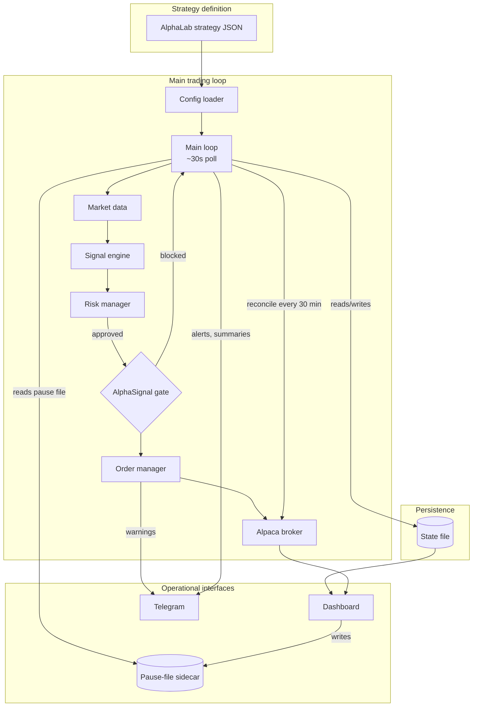
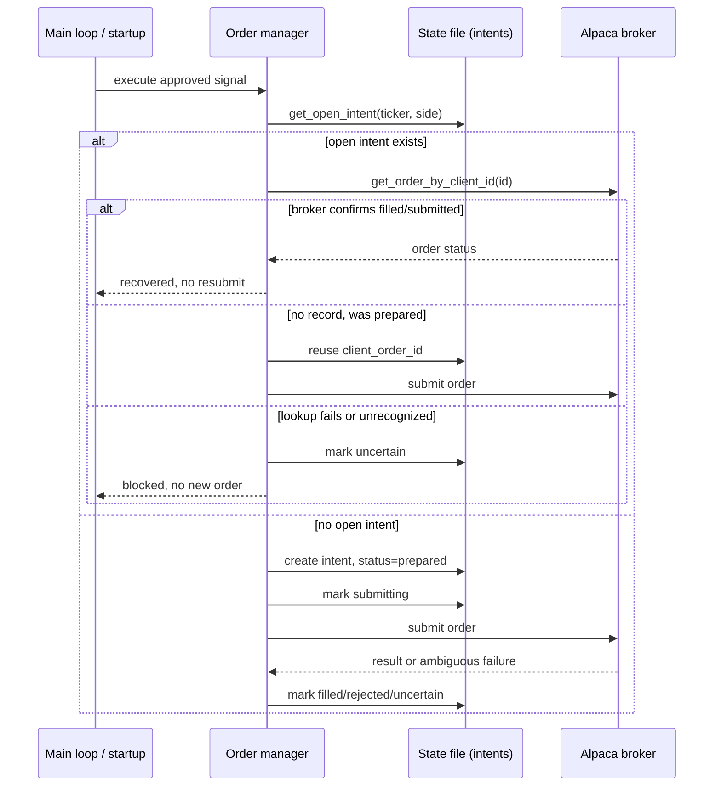

# AlphaLive

AlphaLive is a Python execution and risk-management engine for systematic trading strategies. It loads schema-compatible strategy configurations exported from [AlphaLab](https://github.com/bernardoguterres/AlphaLab), independently regenerates trading signals from live market data, applies layered risk controls, optionally consults an AlphaSignal sentiment service, and routes approved orders through an Alpaca broker adapter. Its strongest engineering features are durable order-submission intents that survive crashes and restarts, reconciliation against the broker's actual positions, drift detection, per-timeframe scheduling, and operational controls (Telegram, a pause/resume kill switch, a monitoring dashboard).

**This is a working prototype, not a system that has been validated through a real Alpaca paper-account runtime or with real money.** Exercised so far: config loading/validation against real AlphaLab exports (`run.py --validate-only`); signal generation cross-checked against AlphaLab on historical fixtures; risk management, state persistence, and reconciliation against a mocked broker; the AlphaSignal gate against a running instance over real HTTP calls (fail-open confirmed for timeout/no-data, blocking confirmed for threshold-breaching sentiment). Not exercised: a real paper-account runtime, long-duration unattended operation, any Railway deployment, or real-money trading (see [Known Limitations](#known-limitations)). Treat everything below as implemented and tested in isolation, not proven in production.

---

## Engineering Highlights

- **Independent signal re-implementation.** AlphaLive re-implements each strategy against the same schema rather than importing AlphaLab's code, so a cross-repo parity test can catch drift instead of trusting one implementation by construction.
- **Layered risk gating.** Every signal passes, in order, kill switches, trade-frequency/API-budget limits, degraded-mode detection, loss breakers, position caps, and cooldowns.
- **Durable submission intents.** Each BUY/SELL/CLOSE persists an intent with a UUID-derived `client_order_id` before any broker call, reused across retries and restarts; recovery queries the broker by that ID rather than guessing ([details](#durable-submission-intents-and-restart-reconciliation)).
- **Persisted, reconciled state with drift detection.** State persists after each check, restores at boot, and reconciles against Alpaca's actual positions (ledger as ground truth); mid-session disagreement halts trading rather than continuing on a stale assumption.

---

## System Architecture



AlphaLive is a continuously running process, polling roughly every 30 seconds during market hours; this is process structure, not validated 24/7 availability. Railway is one possible place to run it and is omitted from the diagram.

---

## Execution Lifecycle and Reliability

Each loop iteration checks the market and the dashboard's pause file, then runs whichever strategy checks are due: `1Day`/`1Week` after ~09:35 ET (a per-ticker "checked today" flag), `1Hour` hourly, `15Min` every 15 minutes, and exits every 5 minutes. The loop never exits on an unhandled error; a catch-all sleeps 60 seconds and continues.

**Risk checks run in a fixed order:** kill switch (`TRADING_PAUSED` / Telegram `/pause`), trade-frequency limit, API budget, degraded-mode status, daily loss limit, consecutive-loss breaker, position caps, cooldown. SELLs skip position-cap/cooldown but respect the rest, size only from held broker quantity, and are blocked with no open position, so AlphaLive never shorts.

**The AlphaSignal sentiment gate is optional, fails open, and applies both ways:** negative sentiment can block a BUY, positive sentiment a SELL. Timeout, no data, malformed responses, full degradation, and unusable partial degradation all fail open with a distinct, logged reason. A structurally valid partial degradation (at least one reliable chunk, a non-null score) is evaluated through the normal threshold instead, tagged distinctly from an undegraded result. The gate covers only strategy-generated BUY/SELL signals, never protective exits, and never bypasses the independent risk, pause, or reconciliation checks evaluated elsewhere.

**Position reconciliation** compares live positions against the persisted ledger, not order history: once at startup (adopting/removing drift with a Telegram notice, not a halt) and again every 30 minutes (where disagreement halts trading). A greater than 20% overnight move skips the check and alerts via Telegram rather than trading a split-distorted bar.

**Weekly scheduling for `1Week` strategies** evaluates once per ISO calendar week, on the first open session that week, gated by a persisted per-ticker week key so a same-week restart never re-evaluates, and excludes the current, incomplete weekly bar. Completeness is judged against the regular 16:00 ET close and does not model exchange early-close calendars.

---

## Durable Submission Intents and Restart Reconciliation

Every BUY/SELL/CLOSE decision creates a **submission intent**, `{intent_id, client_order_id, ticker, side, qty, status}`, written to the state file before any broker call. The `client_order_id` is a fresh UUID, so distinct decisions never collide and one decision keeps its ID across every retry, timeout, and restart until terminal (`prepared -> submitting -> submitted/partially_filled/filled | rejected | cancelled | expired`, plus quarantine state `uncertain` and terminal `reconciled`). Recovery queries the broker by that ID rather than assuming an outcome; a failed or unrecognized lookup quarantines the intent instead of guessing.



**On boot**, `_reconcile_open_submission_intents()` walks every non-terminal intent left by a crash and reconciles it before the loop starts; an `uncertain` result alerts via Telegram and blocks new orders for that (ticker, side) until resolved. A crash between intent creation and submission, or between broker acceptance and local recording, reuses the same `client_order_id` next attempt, so Alpaca's own idempotency determines the outcome rather than the process guessing. This is **duplicate-resistant recovery within Alpaca's API semantics, not mathematically guaranteed exactly-once execution**: an unavailable lookup is quarantined, not resubmitted or declared failed, clearing only through later reconciliation or operator action (`tests/test_order_intent_lifecycle.py` covers the scenarios).

**CLOSE orders use the same durable path.** `close_position()` submits an ordinary market SELL through the same mechanism, sized from a fresh position read rather than Alpaca's close-position endpoint (no idempotency key there). An open or partially filled prior close is reconciled, never resubmitted; a cancelled/expired order produces a new one only when the expected remainder matches the current position. A full fill the position endpoint then shows as nonzero, a sign reversal, or any contradiction is quarantined rather than auto-corrected, so repeated `/close_all` calls reuse or reconcile the existing intent instead of duplicating exposure.

---

## AlphaLab Compatibility and Measured Parity

AlphaLab and AlphaLive each independently implement every strategy's signal logic, since importing AlphaLab's code would make a parity test meaningless. Two non-comparable sources of evidence exist and should not be combined into one figure.

**`tests/test_multi_ticker_parity.py`** is pytest-collected, CI-enforced across all 7 daily/intraday strategies on real SPY/MSFT data (500 bars each), and passes at zero mismatches except one `strict=True` `xfail`: `rsi_mean_reversion` on MSFT, 2 of 500 bars, root-caused to a slight ATR disagreement that occasionally shifts a stop-loss exit by a bar.

**`tests/test_signal_parity.py`** is a standalone, non-CI diagnostic writing dated reports to the gitignored `tests/reports/` directory, with fixtures from AlphaLive's own engine (not AlphaLab), so it detects drift against a prior run of this codebase, not an AlphaLab discrepancy. Current output: 4 `ma_crossover` mismatches (unresolved), 43 `rsi_mean_reversion` mismatches (a stale fixture predating a switch to Wilder RSI), 2 `vwap_reversion` mismatches (unresolved), zero for the other two. None of it is independent AlphaLab ground truth, and no aggregate percentage is published.

---

## Dashboard and Operational Interfaces

A separate FastAPI dashboard reads the bot's state file and Alpaca account directly. It is read-only with respect to trading and cannot place or cancel orders. Its two controls are pause/resume (a pause-file sidecar read fresh each loop iteration, independent of Telegram `/pause` and `TRADING_PAUSED`) and a Railway redeploy endpoint (in code, not exercised against a real deployment). It pushes account, position, order, and risk data over a WebSocket every 5 seconds, reflecting reality only when it shares the bot's `STATE_FILE` path.

Telegram, where configured, supports `/status`, `/pause`, `/resume`, `/close_all` (requires `/confirm_close`), `/config [TICKER]`, `/performance [TICKER]`, and `/help`. In multi-strategy mode every command spans all registered strategies: `/pause`/`/resume` gate all of them via a shared, persisted risk-control object; `/status` gives an aggregate plus per-strategy summary; `/close_all` closes each position through its owning strategy and reports failures or uncertain outcomes; `/config`/`/performance` summarize per-strategy unless given an explicit ticker.

---

## Supported Strategies

| Strategy | Timeframe | Entry | Exit |
|---|---|---|---|
| `ma_crossover` | Daily/intraday | Fast SMA crosses above slow SMA | Opposite cross |
| `rsi_mean_reversion` | Daily/intraday | RSI below oversold | RSI returns to 50 |
| `momentum_breakout` | Daily/intraday | N-day high breakout + volume surge | Trailing stop / N-day low breakdown |
| `bollinger_breakout` | Daily/intraday | Close above BB upper band + volume | Close below BB middle |
| `vwap_reversion` | Daily/intraday | Price deviates from VWAP by N std devs + RSI | Returns to VWAP |
| `bollinger_rsi_combo` | Daily/intraday | Price at/below BB lower AND RSI oversold | Price at/above BB middle OR RSI overbought |
| `trend_adaptive_rsi` | Daily/intraday | RSI below regime-adjusted buy threshold | RSI above regime-adjusted sell threshold |
| `greenblatt_weekly` | 1Week | Weekly RSI oversold OR 10w/50w golden cross | 20% trailing stop from peak (always on); optional RSI/SMA exits off by default; min hold 52 weeks |

AlphaLive implements execution logic rather than claiming profitable performance. AlphaLab holds the research/backtesting workflow, whose documented walk-forward coverage is limited (three strategies, two SPY windows, output not committed) and doesn't establish persistent alpha across every strategy above. `vwap_reversion` is parity-tested but not currently exported from AlphaLab as a deployable config.

---

## Quick Start

**Prerequisites:** Python 3.11+, an Alpaca paper trading account (free), optionally a Telegram bot.

```bash
git clone https://github.com/bernardoguterres/AlphaLive.git
cd AlphaLive
pip install -r requirements.txt
cp .env.example .env   # add ALPACA_API_KEY / ALPACA_SECRET_KEY
```

```bash
python run.py --validate-only                                     # config + broker check, no orders
python run.py --dry-run --config configs/example_strategy.json    # signals logged, nothing submitted
python run.py --config configs/example_strategy.json              # paper account (unvalidated against a real funded account)
```

---

## Deployment Configuration

AlphaLive can run as a long-lived process or a container (`Dockerfile`, `Dockerfile.dashboard`, `railway.toml`); no actual Railway deployment has been exercised.

**`STATE_FILE` now defaults to an OS-appropriate persistent data directory** (e.g. `~/Library/Application Support/AlphaLive/` on macOS, XDG-style on Linux) rather than `/tmp`, via `default_state_file_path()`, a better local/dev default, not proof of durable hosted storage, since a container filesystem is ephemeral regardless. Hosted execution still needs a mounted Railway Volume, `STATE_FILE` pointed at it, and `PERSISTENT_STORAGE=true`; an ephemeral-looking hosted path triggers a startup warning, and trailing-stop strategies refuse to start without `PERSISTENT_STORAGE=true`.

Key environment variables:

| Variable | Required | Notes |
|---|---|---|
| `ALPACA_API_KEY`, `ALPACA_SECRET_KEY` | Yes | Alpaca credentials |
| `STRATEGY_CONFIG` / `STRATEGY_CONFIG_DIR` | Yes (one of) | Single strategy or multi-strategy dir |
| `ALPACA_PAPER` | No, `true` | `false` for live trading |
| `STATE_FILE` | No, OS-appropriate data dir | Must be a mounted volume for hosted durability |
| `PERSISTENT_STORAGE` | No, `false` | Required for trailing stops |
| `DRY_RUN` | No, `false` | Logs signals, places no orders |
| `TRADING_PAUSED` | No, `false` | Env-level kill switch |
| `TELEGRAM_BOT_TOKEN`, `TELEGRAM_CHAT_ID` | No | Notifications and commands |
| `ALPHASIGNAL_URL`, `ALPHASIGNAL_ENABLED` | No | Sentiment gate |

Multi-strategy mode (`STRATEGY_CONFIG_DIR`) enforces one strategy per ticker at startup, since Alpaca holds one merged position per symbol.

---

## Verification

```bash
pytest tests/ -v                              # 863 passed, 1 xfailed
pytest tests/test_multi_ticker_parity.py      # CI-enforced parity checks
python run.py --validate-only                 # requires paper credentials and network access
```

The one `xfail` is the `rsi_mean_reversion`/MSFT ATR residual described above, `strict=True` so it can't drift silently. The pytest suite mocks all external integrations and needs no API keys or network access; `run.py --validate-only` needs real credentials plus network access, so it was not run for this pass. `tests/test_signal_parity.py` is excluded here since it writes report files. CI runs the suite on every push/PR to `main` with dummy credentials.

---

## Known Limitations

- **No exercised paper-account runtime, Railway deployment, or long-duration unattended runtime; no real-money trading has ever been performed.** All reliability mechanisms are tested only against a mocked broker.
- **Submission intents are duplicate-resistant, not exactly-once.** An unavailable/unrecognized broker lookup quarantines the intent as `uncertain`, clearing only via reconciliation or operator action ([details](#durable-submission-intents-and-restart-reconciliation)).
- **Hosted persistence still requires a mounted volume**, `STATE_FILE` pointed at it, and `PERSISTENT_STORAGE=true`; the local default only helps local/dev, and an ephemeral hosted path triggers a startup warning.
- **A single in-process lock serializes `BotState` mutations**, not across processes; the dashboard only interacts through the shared state file.
- **No early-close-calendar awareness** in weekly scheduling, and **parity is incomplete**, not represented by an aggregate percentage ([details](#alphalab-compatibility-and-measured-parity)).
- **The dashboard cannot place orders** and is only as current as the shared state file and account it reads.
- **PDT rule is not tracked** (sub-$25k accounts must monitor Alpaca's own counter); **`configs/production/`** is a historical name, not a claim of production readiness.

---

## License

All rights reserved. Proprietary, original work; no license is granted for use, copying, or redistribution.

---

## Disclaimer

**Trading involves substantial risk of loss. Past performance does not guarantee future results.**

AlphaLive is provided "as is," without warranty of any kind. Nothing here claims production readiness, validated live trading, or continuous uptime. Test on paper before real funds, and monitor any deployment regularly.

**Use at your own risk.**
