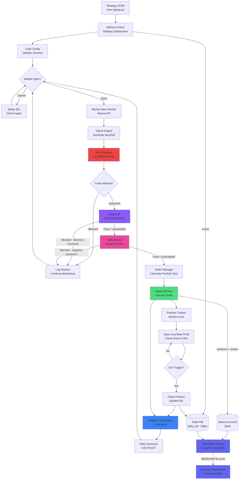

# AlphaLive

**24/7 live trading execution engine** for strategies exported from AlphaLab.

Export a backtested strategy from AlphaLab → deploy to Railway → it trades automatically. Monitor via a real-time web dashboard with live P&L charts, position tracking, and a kill switch. Telegram alerts for every trade and daily summaries.

---

## AlphaLab vs AlphaLive: What's the Difference?

**AlphaLab** and **AlphaLive** are two separate platforms that work together, with **AlphaSignal** as an optional sentiment enrichment layer:

| Repo | Purpose | When to Run | Where to Run |
|------|---------|-------------|--------------|
| **[AlphaLab](https://github.com/bernardoguterres/AlphaLab)** | Strategy development & backtesting | As needed (not 24/7) | Locally on your computer |
| **[AlphaLive](https://github.com/bernardoguterres/AlphaLive)** (this repo) | Live trading execution | 24/7 during trading hours | Railway (recommended) or locally |
| **[AlphaSignal](https://github.com/bernardoguterres/AlphaSignal)** | Financial RAG — sentiment signals from SEC filings | Optional enrichment layer | Locally or any cloud host |
| **[DeepLOB](https://github.com/bernardoguterres/DeepLOB)** | CNN+LSTM LOB prediction — execution timing filter | Optional (queried before each order) | Locally or any cloud host |

### AlphaLab (Development Platform)

**What it does**:
- Develop trading strategies (code signal logic)
- Backtest on 5 years of historical data
- Optimize parameters (walk-forward validation, grid search)
- Export strategies as JSON for AlphaLive

**When you use it**:
- Creating new strategies
- Testing strategy ideas
- Monthly re-backtesting on new data
- Analyzing why live performance differs from backtest

**Run it**: Only when developing/testing strategies (NOT 24/7)

### AlphaLive (Execution Platform)

**What it does**:
- Load strategy JSON from AlphaLab
- Connect to Alpaca broker (paper or live account)
- Generate buy/sell signals in real-time
- Execute trades automatically
- Monitor positions for stop loss / take profit
- Send Telegram alerts
- Real-time web dashboard — live P&L charts, position table, kill switch, CSV export

**When you use it**:
- 24/7 during trading hours (9:30 AM - 4:00 PM ET, Mon-Fri)
- Runs continuously even when you're asleep/away

**Run it**: 24/7 on Railway (recommended) or locally

### Complete Workflow

```
┌─────────────────────────────────────────────────────────────────┐
│                   AlphaLab (Local, As Needed)                   │
└─────────────────────────────────────────────────────────────────┘
         │
         │ 1. Develop strategy
         │ 2. Backtest on historical data
         │ 3. Optimize parameters
         │ 4. Export as JSON
         ↓
┌─────────────────────────────────────────────────────────────────┐
│              AlphaLive (Railway or Local, 24/7)                 │
└─────────────────────────────────────────────────────────────────┘
         │
         │ 5. Load strategy JSON
         │ 6. Run dry run (1 week)
         │ 7. Run paper trading (2-4 weeks)
         │ 8. Run live trading (gradual scale up)
         ↓
┌─────────────────────────────────────────────────────────────────┐
│                  Monitor & Analyze Results                      │
└─────────────────────────────────────────────────────────────────┘
         │
         │ 9. Compare live vs backtest performance
         │ 10. If performance degrades: back to AlphaLab
         │ 11. Re-optimize and re-export
         └──────────────┐
                        │ (loop back to step 1)
```

**You need BOTH platforms** — AlphaLab develops strategies, AlphaLive executes them.

---

## Deployment Options: Local vs Railway

AlphaLive can run **locally on your computer** (FREE) or **on Railway** (~$5-20/month).

### Running Locally

**Best for**:
- Testing (dry run, paper trading)
- Saving money (~$5-20/month)
- Full control over environment

**Requirements**:
- Your computer must be **ON 24/7** during trading hours (9:30 AM - 4:00 PM ET)
- Stable internet connection
- No sleep/hibernate during trading hours

**Risks**:
- Power outage = missed trades
- Computer restart = bot stops until you manually restart it
- Internet outage = no trading
- You must be available to restart bot if it crashes

**How to run locally**:
```bash
# Foreground (blocks terminal, Ctrl+C to stop)
python run.py --config configs/your_strategy.json

# Background (keeps running after closing terminal)
nohup python run.py --config configs/your_strategy.json > alphalive.log 2>&1 &

# Check if running
ps aux | grep "run.py"

# Stop background process
pkill -f "run.py"
```

### Running on Railway (Recommended for Live Trading)

**Best for**:
- Live trading with real money
- 24/7 reliability (professional infrastructure)
- Auto-restart on crashes
- Deploy updates from anywhere (git push)

**Benefits**:
- Bot runs even when your computer is off
- Auto-restart if process crashes
- View logs from anywhere (phone, laptop)
- No need to manage servers

**Cost**: ~$5-20/month (Hobby plan or pay-as-you-go)

**How to deploy**: See the [Deploy to Railway](#deploy-to-railway) section below

### Comparison Table

| Feature | Local | Railway |
|---------|-------|---------|
| **Cost** | FREE | ~$5-20/month |
| **Uptime** | Only when your computer is on | 24/7 professional infrastructure |
| **Auto-restart on crash** | No (manual) | Yes (automatic) |
| **Deploy updates** | Local only | From anywhere (git push) |
| **View logs** | Local terminal only | From anywhere (dashboard) |
| **Power outage protection** | No | Yes |
| **Best for** | Testing, development | Live trading |

### Our Recommendation

| Phase | Recommended Deployment |
|-------|------------------------|
| **Phase 1: Dry Run** (1 week) | Local (free) |
| **Phase 2: Paper Trading** (2-4 weeks) | Local or Railway (your choice) |
| **Phase 3-4: Live Trading** | Railway (reliability is worth $5-20/month) |

**Bottom line**: Test locally for free, deploy to Railway when going live.

---

## What You Need to Run

### For Development & Backtesting

**Platform**: AlphaLab (separate repository)

**Run it**:
- Locally on your computer
- As needed (not 24/7)
- When developing new strategies or re-backtesting

**Cost**: FREE

### For Testing (Dry Run & Paper Trading)

**Platform**: AlphaLive (this repository)

**Run it**:
- Locally: `python run.py --dry-run` (dry run mode)
- Locally: `python run.py` (paper trading mode)
- Railway: Deploy with `DRY_RUN=true` or `ALPACA_PAPER=true`

**Cost**: FREE (local) or ~$5-20/month (Railway)

### For Live Trading

**Platform**: AlphaLive (this repository)

**Run it**:
- Railway (recommended): See the [Deploy to Railway](#deploy-to-railway) section below
- Or locally: `python run.py` with `ALPACA_PAPER=false`

**Requirements**:
- Alpaca live account (FREE, but real money at risk)
- Optional: Market data subscription (~$15-30/month for real-time SIP data)
- Railway subscription (~$5-20/month) if using Railway

**Total cost for live trading**:
- Minimum: $0/month (local + free Alpaca + IEX data)
- Recommended: $5-50/month (Railway $5-20 + optional SIP data $15-30)

---

## How It Works

1. **Backtest strategies in AlphaLab** until you find ones you like
2. **Click "Export to AlphaLive"** → saves a JSON config with your strategy parameters
3. **Commit the JSON** to `configs/` in this repo
4. **Deploy to Railway** (or run locally for testing)
5. **AlphaLive runs 24/7**: sleeps when market is closed, trades when open
6. **Get Telegram alerts** for every trade, exit, and daily summary

---

## Architecture



### Key Components

AlphaLive is a production-grade trading bot with:

- **Signal Generation**: Replicates AlphaLab strategy logic exactly (8 strategies supported, including `greenblatt_weekly` on weekly bars)
- **Risk Management**: Stop loss, take profit, trailing stop, position sizing, daily limits
- **Order Execution**: Alpaca Markets API with retry logic, slippage checks, partial fill handling
- **Market Data**: Real-time bars from Alpaca with caching and staleness detection
- **Pre-Execution Gate**: DeepLOB (LOB direction prediction) and AlphaSignal (sentiment) run **concurrently** via `asyncio.gather` before each order — both must pass. Either filter fails open on timeout or unavailability.
- **Notifications**: Telegram alerts for trades, exits, errors, daily summaries
- **Resilience**: Auto-restart on Railway, position reconciliation, corporate action detection
- **Web Dashboard**: Real-time monitoring UI (FastAPI + WebSocket) — live P&L charts, open positions, trailing stop levels, kill switch, CSV export, one-click Railway redeploy

**Market Closed Behavior**:
- Checks if market is open every 30 seconds
- Sleeps efficiently when closed (no wasted API calls)
- Wakes up at 9:30 AM ET and starts trading

**Signal Timing**:
- **1Week strategies**: Check once per week, Monday morning at 9:35 AM ET
- **1Day strategies**: Check once per day at 9:35 AM ET
- **1Hour strategies**: Check every hour at :00 minutes
- **15Min strategies**: Check every 15 minutes (:00, :15, :30, :45)

> **Note on 1Week:** Alpaca does not serve weekly bars natively. AlphaLive fetches daily bars and resamples them to weekly internally (`W-FRI` aggregation). No extra configuration needed.

**Exit Monitoring**:
- Checks stop loss / take profit every 5 minutes during market hours
- Corporate action detection (skips trading on 20% overnight moves)
- End-of-day summary sent at 3:55 PM ET

---

## Local Development

### Prerequisites

- Python 3.11+
- Alpaca Markets account (free paper trading account)
- Telegram bot (optional, for notifications)

### Setup

1. **Clone the repo**:
   ```bash
   git clone https://github.com/bernardoguterres/AlphaLive.git
   cd AlphaLive
   ```

2. **Install dependencies**:
   ```bash
   pip install -r requirements.txt
   ```

3. **Configure environment**:
   ```bash
   cp .env.example .env
   # Edit .env with your API keys
   ```

4. **Create a strategy config** or use the example:
   ```bash
   # configs/example_strategy.json already exists
   # Or export from AlphaLab to configs/
   ```

5. **Validate configuration** (recommended first step):
   ```bash
   python run.py --validate-only
   ```

   This tests:
- Strategy JSON is valid
- Alpaca connection works
- Market data fetch works
- Signal generation works

6. **Run in dry-run mode** (recommended for testing):
   ```bash
   python run.py --dry-run
   ```

   This logs trades without executing them. Perfect for testing signal logic.

7. **Run with paper trading**:
   ```bash
   python run.py
   ```

   Default is paper trading (`ALPACA_PAPER=true`). Safe for testing with fake money.

### CLI Options

```bash
python run.py [OPTIONS]

Options:
  --config PATH         Path to strategy JSON (default: STRATEGY_CONFIG env var)
  --dry-run             Log trades without executing (for testing)
  --validate-only       Test config and connections, then exit
  --replay-mode         Test on historical data (FREE - no subscription needed)
  --replay-start DATE   Start date for replay (YYYY-MM-DD, default: 2015-01-01)
  --replay-end DATE     End date for replay (YYYY-MM-DD, default: 2019-12-31)
```

---

## Replay Mode: Test Before You Trade (FREE)

Before paying for Alpaca premium, test your strategy on **9+ years of historical data** for FREE:

```bash
# Test on 2015-2019 (pre-COVID normal markets)
python run.py \
  --config configs/your_strategy.json \
  --replay-mode \
  --replay-start 2015-01-01 \
  --replay-end 2019-12-31 \
  --dry-run
```

**What you get:**
- Test on 5-9 years of historical data (100% FREE)
- See signals, trades, P&L, win rate
- Verify strategy works before upgrading to premium
- Smart defaults avoid COVID-19 market anomalies

**Recommended testing:**
1. **Pre-COVID** (2015-2019): 5 years of normal markets
2. **Post-COVID** (2022-2024): 3 years of recovery

**Cost:** $0 (historical data is free on Alpaca)

**Use the interactive test script:**
```bash
./test_replay_mode.sh
```

---

## Testing Strategies with Real Historical Data (No API Keys Needed)

Use `yfinance` (free, no account required) to test signal logic across any ticker locally:

```bash
pip install yfinance  # already in requirements.txt
```

```python
import sys, yfinance as yf, pandas as pd
sys.path.insert(0, '.')

from alphalive.strategy.signal_engine import SignalEngine
from alphalive.strategy_schema import StrategySchema
from datetime import datetime

# Download any ticker — data stays in memory, nothing written to disk
raw = yf.download('SPY', start='2021-01-01', end='2026-01-01', auto_adjust=True)
df = raw.rename(columns={'Close':'close','High':'high','Low':'low','Open':'open','Volume':'volume'})
df = df[['open','high','low','close','volume']].reset_index().rename(columns={'Date':'timestamp'})

# Build a minimal config
config = StrategySchema(
    schema_version='1.0',
    strategy={'name': 'rsi_mean_reversion', 'parameters': {'period': 14, 'oversold': 30, 'overbought': 70}},
    ticker='SPY', timeframe='1Day',
    risk={'stop_loss_pct': 2.0, 'take_profit_pct': 5.0, 'max_position_size_pct': 10.0,
          'max_daily_loss_pct': 5.0, 'max_open_positions': 3, 'portfolio_max_positions': 10},
    execution={'order_type': 'market'}, safety_limits={},
    metadata={'exported_from': 'test', 'exported_at': datetime.now().isoformat(),
              'alphalab_version': '1.0.0', 'backtest_id': 'test',
              'backtest_period': {'start': '2021-01-01', 'end': '2026-01-01'},
              'performance': {'sharpe_ratio': 1.5, 'sortino_ratio': 2.0, 'total_return_pct': 25.0,
                              'max_drawdown_pct': 10.0, 'win_rate_pct': 55.0, 'profit_factor': 1.8,
                              'total_trades': 100, 'calmar_ratio': 2.5}},
)

engine = SignalEngine(config)

# Replay bars and count signals
buys, sells = 0, 0
for i in range(60, len(df)):
    result = engine.generate_signal(df.iloc[:i+1].copy())
    if result['signal'] == 'BUY': buys += 1
    elif result['signal'] == 'SELL': sells += 1

print(f'BUY: {buys}  SELL: {sells}  over {len(df)-60} bars')
```

**Tested on 20 tickers (SPY, QQQ, AAPL, MSFT, NVDA, META, TSLA, AMD, TSM, JPM, BAC, JNJ, UNH, XOM, COST, V, GOOGL, AMZN, IWM, DIA) — all strategies ran without errors across 1,276 bars each.**

Note: `data/` and `*.parquet` are gitignored — downloaded data is never committed to the repo.

---

## Deploy to Railway

Railway is the recommended host — it runs 24/7 for ~$5/month and auto-restarts on crash.

### 1. Prerequisites

- [Railway account](https://railway.app) (free tier works for testing)
- Alpaca Markets account — sign up at [alpaca.markets](https://alpaca.markets), go to **Your API Keys**, and generate **paper trading** keys first
- Strategy JSON exported from [AlphaLab](https://github.com/bernardoguterres/AlphaLab) placed in `configs/`
- (Optional) Telegram bot token from [@BotFather](https://t.me/BotFather)

### 2. Create the Railway project

1. Go to [railway.app/new](https://railway.app/new) → **Deploy from GitHub repo**
2. Select your AlphaLive fork — Railway detects the `Dockerfile` automatically
3. Go to **Variables** and add:

```bash
# Required
ALPACA_API_KEY=PK...
ALPACA_SECRET_KEY=...
STRATEGY_CONFIG=configs/ma_crossover_SPY.json

# Strongly recommended
ALPACA_PAPER=true                    # always start with paper trading
TELEGRAM_BOT_TOKEN=123456:ABC-DEF...
TELEGRAM_CHAT_ID=123456789
LOG_LEVEL=INFO
HEALTH_SECRET=$(openssl rand -hex 16) # generate a random string
```

4. Click **Deploy** — Railway builds the image and starts the bot

**Expected startup log**:
```
ALL VALIDATIONS PASSED
Market is closed — sleeping until 9:30 AM ET
```

### 3. Cost

| Plan | Price | Best for |
|------|-------|----------|
| Starter | $5/month | 1–3 strategies |
| Hobby | $20/month | 4+ strategies, unlimited hours |

### 4. Production checklist (before switching to live money)

- [ ] Ran `DRY_RUN=true` for at least one full trading day — signals look correct
- [ ] Ran `ALPACA_PAPER=true` for 1+ weeks — execution and P&L match expectations
- [ ] Stop loss and take profit triggered correctly in paper (verify in logs)
- [ ] Telegram notifications working — received trade alerts and EOD summary
- [ ] Signal parity test passes: `pytest tests/test_signal_parity.py`
- [ ] Walk-forward Sharpe in AlphaLab > 0.8 in both test windows

### 5. Switching to live trading

1. Generate **live trading keys** in Alpaca (separate from paper keys)
2. Update Railway variables: `ALPACA_PAPER=false`, new `ALPACA_API_KEY` + `ALPACA_SECRET_KEY`
3. Railway auto-redeploys in ~30 seconds
4. Watch logs for the first hour; be ready to set `TRADING_PAUSED=true` if anything looks wrong

### 6. Kill switch

Fastest way to halt all new entries without stopping the process:

```bash
# Telegram (instant, no restart needed):
/pause

# Railway dashboard (15–30s restart):
Set TRADING_PAUSED=true in Variables
```

### Troubleshooting

| Error | Cause | Fix |
|-------|-------|-----|
| `Invalid API key` | Wrong key type (paper vs live) | Match `ALPACA_PAPER` to your key type |
| `Data is stale` | Market closed or feed delay | Normal — bot resumes at 9:30 AM ET automatically |
| `Telegram offline` | Wrong token or chat ID | Check `TELEGRAM_BOT_TOKEN` has no extra spaces |
| `Daily loss limit exceeded` | Hit `max_daily_loss_pct` | Working as intended — resumes next trading day |
| No trades executing | Paused, dry run, or risk limits | Check logs for signal checks and risk rejections |

---

## Environment Variables

### Required

| Variable | Description | Example |
|----------|-------------|---------|
| `ALPACA_API_KEY` | Alpaca API key (get from alpaca.markets) | `PK...` |
| `ALPACA_SECRET_KEY` | Alpaca secret key | `xxx...` |
| `STRATEGY_CONFIG` | Path to strategy JSON file | `configs/ma_crossover.json` |

### Optional

| Variable | Default | Description |
|----------|---------|-------------|
| `ALPACA_PAPER` | `true` | Use paper trading (recommended for testing) |
| `TELEGRAM_BOT_TOKEN` | `None` | Telegram bot token (for notifications) |
| `TELEGRAM_CHAT_ID` | `None` | Your Telegram chat ID |
| `LOG_LEVEL` | `INFO` | Logging level (DEBUG, INFO, WARNING, ERROR) |
| `DRY_RUN` | `false` | Log trades without executing |
| `TRADING_PAUSED` | `false` | Pause trading (kill switch) |
| `ALPHASIGNAL_URL` | `http://localhost:8000` | AlphaSignal service base URL |
| `ALPHASIGNAL_ENABLED` | `true` | Set `false` to bypass sentiment filter |
| `ALPHASIGNAL_SENTIMENT_THRESHOLD` | `-0.3` | Score below which longs are blocked |
| `DEEPLOB_URL` | `http://localhost:8001` | DeepLOB inference server base URL |
| `DEEPLOB_ENABLED` | `true` | Set `false` to bypass LOB timing filter |
| `DEEPLOB_CONFIDENCE_THRESHOLD` | `0.6` | Minimum softmax confidence to allow execution |
| `DEEPLOB_TIMEOUT_SECONDS` | `2.0` | Per-request timeout (keep ≤ 2 s) |

### Getting API Keys

**Alpaca Markets**:
1. Sign up at [alpaca.markets](https://alpaca.markets)
2. Go to **Your API Keys** in dashboard
3. Generate new paper trading keys
4. Copy API Key and Secret Key

**Telegram Bot**:
1. Open Telegram and search for **@BotFather**
2. Send `/newbot` and follow prompts
3. Copy bot token (looks like `123456:ABC-DEF...`)
4. Start a chat with your bot
5. Get your chat ID by visiting: `https://api.telegram.org/bot<YOUR_TOKEN>/getUpdates`
6. Send a message to your bot, then refresh the URL above — your chat ID is in the response

---

## Safety Features

AlphaLive has multiple layers of protection:

### Risk Management

- **Stop Loss**: Automatically close positions at configured loss threshold
- **Take Profit**: Lock in gains at target price
- **Trailing Stop**: Follow price up, exit on pullback (optional)
- **Position Sizing**: Max % of account per position (prevents overexposure)
- **Daily Loss Limit**: Halt all trading if daily loss exceeds threshold
- **Max Positions**: Limit simultaneous open positions

### Circuit Breakers

- **Consecutive Loss Breaker**: Pause trading after 3 stop-outs in a row
- **Kill Switch**: Set `TRADING_PAUSED=true` in Railway to halt immediately
- **Corporate Action Detection**: Skip trading on 20% overnight moves (stock splits, etc.)
- **Position Drift Auto-Halt**: Halts if Alpaca positions don't match bot's internal tracking

### Operational Safety

- **Data Staleness Checks**: Won't trade on old data (market may be closed)
- **Startup Warmup Validation**: Ensures indicators are ready before first trade
- **Rate Limiting**: Exponential backoff prevents API bans
- **Graceful Degradation**: Telegram failures don't crash trading
- **SIGTERM Handling**: Clean shutdown on Railway restarts

### Live Trading Warnings

When you switch to live trading (`ALPACA_PAPER=false`), you'll see:

```
WARNING
LIVE TRADING MODE — REAL MONEY AT RISK
WARNING
```

**Recommendation**: Run on paper for at least 1 week before switching to live.

---

## Strategies Supported

AlphaLive supports 8 strategies exported from AlphaLab.

> **Performance reality check:** Walk-forward testing shows all 7 validated daily/intraday strategies underperform buy-and-hold SPY (~0.5% vs 13.7% CAGR). Do not go live with daily strategies until walk-forward Sharpe > 0.8 and CAGR > 13%. The `greenblatt_weekly` strategy is the current development focus.

### 1. MA Crossover
**Description**: Buy when fast SMA crosses above slow SMA, sell when it crosses below.

**Parameters**:
- `fast_period`: Fast SMA period (default: 10)
- `slow_period`: Slow SMA period (default: 20)

**Best For**: Trending markets, daily timeframes

---

### 2. RSI Mean Reversion
**Description**: Buy when RSI is oversold, sell when overbought.

**Parameters**:
- `period`: RSI period (default: 14)
- `oversold`: Oversold threshold (default: 30)
- `overbought`: Overbought threshold (default: 70)

**Best For**: Range-bound markets, intraday

---

### 3. Momentum Breakout
**Description**: Buy on new high with volume surge.

**Parameters**:
- `lookback`: Lookback period for rolling high (default: 20)
- `surge_pct`: Volume surge multiplier (default: 1.5)
- `atr_period`: ATR period for trailing stop (default: 14)

**Best For**: Volatile stocks, breakout plays

---

### 4. Bollinger Breakout
**Description**: Buy on consecutive closes above upper band with volume confirmation.

**Parameters**:
- `period`: Bollinger Bands period (default: 20)
- `std_dev`: Standard deviation multiplier (default: 2.0)
- `confirmation_bars`: Consecutive bars above/below band (default: 2)

**Best For**: Trend continuation, daily/hourly

---

### 5. VWAP Reversion
**Description**: Buy when price is far below VWAP and RSI is oversold, sell when far above and RSI is overbought.

**Parameters**:
- `deviation_threshold`: Deviation in standard deviations (default: 2.0)
- `rsi_period`: RSI period (default: 14)
- `oversold`: RSI oversold threshold (default: 30)
- `overbought`: RSI overbought threshold (default: 70)

**Best For**: Intraday mean reversion

---

### 6. Bollinger RSI Combo
**Description**: Dual confirmation—requires BOTH price ≤ BB lower AND RSI < 45 for entry.

**Parameters**:
- `bb_period`: Bollinger Bands period (default: 20)
- `bb_std_dev`: Standard deviation (default: 2.0)
- `rsi_period`: RSI period (default: 14)
- `rsi_entry`: RSI entry threshold (default: 45)
- `rsi_exit`: RSI exit threshold (default: 55)

**Best For**: High-precision entries, 15Min or Daily timeframes (1-3 signals/day)

> Win rate and Sharpe figures removed — not walk-forward validated.

---

### 7. Trend Adaptive RSI
**Description**: Adjusts RSI thresholds based on market regime (uptrend/downtrend/range).

**Parameters**:
- `rsi_period`: RSI period (default: 14)
- `trend_sma_fast`: Fast trend SMA (default: 20)
- `trend_sma_slow`: Slow trend SMA (default: 50)
- **Uptrend**: Buy RSI 45, Sell 65
- **Downtrend**: Buy RSI 35, Sell 55
- **Range**: Buy RSI 35, Sell 65

**Best For**: Adaptive to changing markets, 1Hour timeframes (1-2 signals/day)

> Win rate and Sharpe figures removed — not walk-forward validated.

---

### 8. Greenblatt Weekly (`greenblatt_weekly`) — value factor, weekly bars

**Designed for ~1 year holding periods.** Run the Greenblatt screener in AlphaLab first to identify quality candidates (earnings yield + ROE ranked), then deploy weekly entry timing in AlphaLive.

**Timeframe**: `1Week` — AlphaLive fetches daily Alpaca bars and resamples to weekly automatically.

**Entry** (either condition on weekly bars):
- Weekly RSI < 35 (oversold)
- 10-week SMA crosses above 50-week SMA (golden cross)

**Exit:**
- **Default (always active):** Price drops 20% below position peak — trailing stop fires immediately, bypasses minimum hold
- **Opt-in (disabled by default):** Weekly RSI > 65, or 10w/50w SMA death-cross — only fires after minimum hold elapsed

**Key params:** `fast_sma` (10), `slow_sma` (50), `rsi_oversold` (35), `rsi_overbought` (65), `min_hold_bars` (52), `trailing_stop_pct` (0.20)

**Minimum hold enforcement:** AlphaLive tracks `entry_timestamps` in `state.json`. SELL signals are suppressed until `min_hold_bars` weeks have elapsed, except for the trailing stop which always fires immediately.

---

## Production Configs

AlphaLive includes **5 production-ready strategy configs** in `configs/production/`:

| Config | Strategy | Ticker | Timeframe | Notes |
|--------|----------|--------|-----------|-------|
| `rsi_simple_SPY_15Min.json` | RSI Mean Reversion (relaxed 40/60 thresholds) | SPY | 15Min | Not walk-forward validated |
| `bollinger_rsi_SPY_15Min.json` | Bollinger RSI Combo | SPY | 15Min | Not walk-forward validated |
| `trend_adaptive_SPY_1Hour.json` | Trend Adaptive RSI | SPY | 1Hour | Not walk-forward validated |
| `rsi_mean_reversion_SPY_RELAXED.json` | RSI Mean Reversion | SPY | Daily | Not walk-forward validated |
| `ma_crossover_AAPL_FAST.json` | MA Crossover | AAPL | Daily | Not walk-forward validated |

> **None of these configs have passed walk-forward validation.** All daily/intraday strategies underperform buy-and-hold SPY in out-of-sample testing. Run `walk_forward_validation.py` in AlphaLab before deploying any config with real money.

---

## Multi-Strategy Mode

AlphaLive can run **multiple strategies simultaneously** by loading all JSONs from a directory:

1. **Export multiple strategies** from AlphaLab
2. **Place all JSONs** in `configs/` directory
3. **Set environment variable**:
   ```bash
   STRATEGY_CONFIG_DIR=configs/
   ```
4. **Deploy** → AlphaLive runs all strategies in parallel

**Risk Scope**:
- **Per-Strategy Limits**: `max_open_positions`, `stop_loss_pct`, `take_profit_pct`
- **Global Limits**: `max_daily_loss_pct` (halts ALL strategies), `portfolio_max_positions` (total positions across all)

**Example**: 3 strategies with `max_open_positions=[5,3,2]` → total potential = 10 positions, but `portfolio_max_positions=8` caps it at 8.

---

## Telegram Notifications

When configured, you'll receive:

- **Bot Started**: "🚀 AlphaLive Started" with strategy details
- **Trade Executed**: "🟢 BUY 66 AAPL @ $150.00"
- **Position Closed**: "💰 Position Closed — P&L: $495.00 (+5.00%)"
- **Stop Loss Hit**: "⚠️ Position Closed — AAPL -$300.00"
- **Daily Summary**: "📈 Daily Summary — 5 trades, $450 profit, 60% win rate"
- **Error Alerts**: "⚠️ Alpaca API timeout"
- **Circuit Breaker**: "⚠️ 3 consecutive losses — trading paused"

**Graceful Degradation**: If Telegram fails, trading continues (alerts are lost but trades still execute).

---

## Web Dashboard

AlphaLive includes a real-time web dashboard for monitoring the bot without touching Railway logs or Telegram.

### What it shows
| Panel | Data |
|---|---|
| Stat cards | Portfolio value, daily P&L (green/red), cash, open positions count |
| Positions table | Every open position — entry price, current price, unrealized P&L, trailing stop level, 20-bar sparkline |
| Daily P&L trend | Live line chart built from WebSocket pushes (session only) |
| Portfolio allocation | Donut chart of position market values |
| Daily loss limit | Progress bar showing how much of your loss limit has been used |
| System status | Trading active/paused, paper/live/dry-run mode, broker connection, market open/closed |
| Recent orders | All of today's Alpaca orders with fill price, value, and status |

### How to run

```bash
# From the project root (venv active)
pip install fastapi "uvicorn[standard]"
uvicorn dashboard.server:app --host 0.0.0.0 --port 8888
```

Open **http://localhost:8888**. Reads from the same `.env` as the bot — no extra config needed.

### How it works
- Connects to the same Alpaca paper/live account as the bot
- Reads the bot's state file (`STATE_FILE`) for daily P&L and position highs
- Pushes a combined data payload to the browser over **WebSocket every 5 seconds** (no polling)
- Per-position sparklines fetched once per session from `/api/bars/{ticker}`
- Optional password protection: set `DASHBOARD_PASSWORD=yourpassword` in `.env`

### What it doesn't do
- Cannot place or cancel orders (read-only)
- Daily P&L trend resets on page reload (session memory only)
- "Bot Since" and "Morning Check" only populate once `main.py` has run and written to the state file

---

## Operational Toolkit

AlphaLive includes **4 operational scripts** for monitoring and analysis:

### 1. Performance Tracker (`scripts/performance_tracker.py`)
Compare live trading performance against backtest expectations.

**Usage:**
```bash
python scripts/performance_tracker.py --config configs/production/rsi_simple_SPY_15Min.json
```

**Features:**
- Fetches completed trades from Alpaca
- Calculates live win rate, P&L, avg win/loss
- Compares to backtest expectations (from config metadata)
- Flags performance divergence (>10% win rate difference)
- Generates detailed performance reports

**When to use**: Weekly to verify live performance matches backtests

---

### 2. Live Signal Monitor (`scripts/live_signal_monitor.py`)
Real-time signal monitoring showing how close you are to generating a signal.

**Usage:**
```bash
python scripts/live_signal_monitor.py --config configs/production/rsi_simple_SPY_15Min.json

# Watch mode (updates every 60s)
python scripts/live_signal_monitor.py --config configs/production/rsi_simple_SPY_15Min.json --watch
```

**Features:**
- Shows current indicator values (RSI, BB, SMA, etc.)
- Displays distance to next signal ("RSI is 52, need 40 to trigger BUY")
- Watch mode updates every 60 seconds
- Educational tool to understand strategy behavior

**When to use**: During first week of deployment to understand signal frequency

---

### 3. Trade Journal Generator (`scripts/generate_trade_journal.py`)
Export all trades to CSV for detailed analysis in Excel/Google Sheets.

**Usage:**
```bash
python scripts/generate_trade_journal.py

# Custom date range
python scripts/generate_trade_journal.py --start-date 2026-01-01 --end-date 2026-03-31

# Custom output file
python scripts/generate_trade_journal.py --output my_trades.csv
```

**Features:**
- Fetches all orders from Alpaca
- Matches buy/sell pairs using FIFO
- Calculates P&L, hold time, outcome (WIN/LOSS)
- Exports to CSV (compatible with Excel, Google Sheets, pandas)
- Includes entry/exit prices, quantities, timestamps

**When to use**: Monthly for tax records, performance analysis, journal reviews

---

### 4. Automated Weekly Report (`scripts/automated_weekly_report.py`)
Automated weekly performance summary with recommendations.

**Usage:**
```bash
# Generate and display report
python scripts/automated_weekly_report.py

# Send via Telegram
python scripts/automated_weekly_report.py --telegram

# Save to file only
python scripts/automated_weekly_report.py --save-only --output-dir reports/
```

**Features:**
- Fetches past week's trades
- Calculates weekly stats (win rate, P&L, best/worst trade)
- Performance assessment (Excellent/Good/Needs Attention)
- Next week recommendations
- Optional Telegram delivery
- Designed for cron automation (every Sunday night)

**Cron setup (weekly reports):**
```bash
# Add to crontab: runs every Sunday at 6 PM
0 18 * * 0 cd /path/to/AlphaLive && python scripts/automated_weekly_report.py --telegram
```

**When to use**: Automate weekly performance reviews

---

**All scripts include:**
- Environment variable validation with helpful errors
- Config path resolution (works from any directory)
- Retry logic for API calls (3 attempts, exponential backoff)
- Progress indicators for long operations
- `--version` flag for tracking
- Full error tracebacks for debugging

---

## Logs

AlphaLive logs to STDOUT in structured format:

```
2026-03-09 09:35:00 [INFO] alphalive.main: Market is open — running signal check
2026-03-09 09:35:01 [INFO] alphalive.data.market_data: Fetched 200 bars for AAPL (latest: 2026-03-09 09:34:00 EST)
2026-03-09 09:35:02 [INFO] alphalive.strategy.signal_engine: BUY signal: MA crossover (fast SMA crossed above slow SMA)
2026-03-09 09:35:03 [INFO] alphalive.execution.order_manager: MARKET BUY 66 AAPL @ market | Order ID: abc123-def456
2026-03-09 09:35:05 [INFO] alphalive.broker.alpaca_broker: Order filled: 66 shares @ $150.25
```

**Railway**: Logs are captured automatically and viewable in dashboard.

**Local**: Logs print to terminal.

---

## Troubleshooting

### "Invalid API key"
- Check that `ALPACA_API_KEY` and `ALPACA_SECRET_KEY` are correct
- Verify you're using **paper trading keys** (not live keys) if `ALPACA_PAPER=true`

### "Data is stale"
- Market may be closed (bot sleeps automatically)
- Check Alpaca status: [status.alpaca.markets](https://status.alpaca.markets)

### "Telegram offline — trading continues but alerts lost"
- Check `TELEGRAM_BOT_TOKEN` and `TELEGRAM_CHAT_ID` are correct
- Verify bot is not blocked
- Bot will auto-retry every 10 minutes

### "Trade blocked: Daily loss limit exceeded"
- Bot has hit `max_daily_loss_pct` for the day
- Trading resumes next trading day automatically

### "Position drift detected — TRADING HALTED"
- Alpaca positions don't match bot's internal tracking
- Manually reconcile positions in Alpaca dashboard
- Set `TRADING_PAUSED=false` to resume

---

## Contributing

AlphaLive is part of the Alpha trading suite:

- **AlphaLab**: Backtest strategies, export to AlphaLive
- **AlphaLive**: Execute strategies 24/7 on Railway (this repo)
- **AlphaSignal**: Optional sentiment filter — SEC filing RAG
- **DeepLOB**: Optional LOB timing filter — CNN+LSTM mid-price predictor

For questions, issues, or contributions, open an issue on GitHub.

---

## Known Limitations

### Pattern Day Trader (PDT) Rule

**What is it**: SEC regulation requiring $25,000 minimum account balance for accounts that execute 4+ day trades within 5 business days.

**How it affects AlphaLive**:
- **Paper Trading**: No PDT restrictions (unlimited day trades)
- **Live Trading with <$25k**:
  - Limited to 3 day trades per 5 business days
  - AlphaLive does NOT track day trade count
  - You must manually monitor via Alpaca dashboard
  - Exceeding limit results in 90-day trading restriction by your broker
- **Live Trading with ≥$25k**: No restrictions

**Recommended Strategies**:
- Use **1Day timeframe** strategies (no day trades)
- Monitor `daytrade_count` in Alpaca dashboard daily
- Set `max_trades_per_day` conservatively in strategy JSON
- Consider swing trading strategies (hold overnight)

**References**:
- [Alpaca PDT Guide](https://alpaca.markets/learn/pattern-day-trading/)
- [SEC PDT Rule](https://www.sec.gov/investor/pubs/daytrade.htm)

---

## License

MIT License — see LICENSE file for details.

---

## Disclaimer

**Trading involves substantial risk of loss. Past performance does not guarantee future results.**

- AlphaLive is provided "as is" without warranty
- You are responsible for your own trading decisions
- Always test on paper trading before using live funds
- Monitor your bot regularly
- Use appropriate position sizing and risk limits

**Use at your own risk.**
