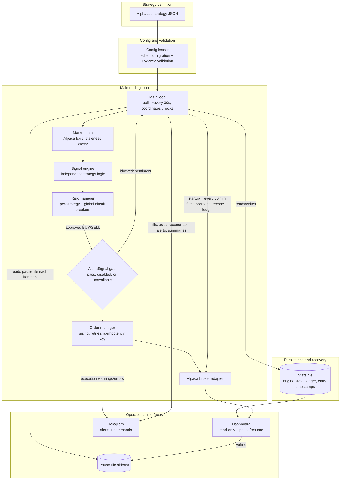
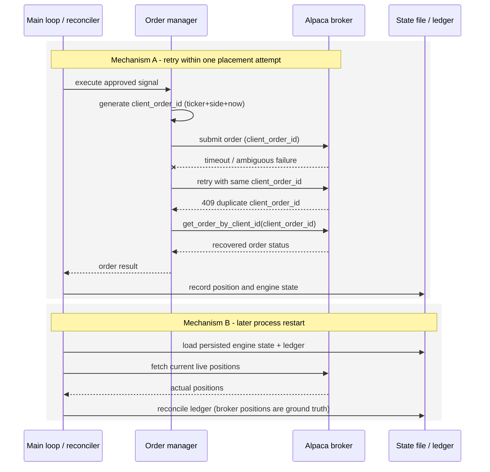

# AlphaLive

An execution and risk engine that consumes strategy exports from [AlphaLab](https://github.com/bernardoguterres/AlphaLab) and can submit orders through Alpaca Markets, built around independently implemented signal logic, layered risk checks, same-process idempotent order retries, persisted strategy state, and broker-position reconciliation.

AlphaLab builds and backtests a strategy and exports a JSON config. AlphaLive loads it, independently regenerates signals from live market data, and runs them through a risk-gate stack before submitting an approved order to Alpaca with a deterministic `client_order_id`. Within one placement attempt, a retry after an ambiguous failure reuses that same ID so Alpaca can reject a genuine duplicate. Strategy state - open positions, engine internals, entry timestamps - is persisted as signal checks and state-changing events complete, and is restored/reconciled against the broker's actual positions on every restart.

---

## Status and Validation Boundary

This is a working prototype with an extensive automated test suite, not a system that has traded real money or run unattended for an extended period.

**What has been exercised:**
- Config loading and schema validation against real AlphaLab strategy JSON exports, including via `run.py --validate-only`.
- Signal generation logic, independently unit-tested and cross-checked against AlphaLab on historical fixtures (see [AlphaLab Compatibility](#alphalab-compatibility-and-measured-parity)).
- Risk management, state persistence, reconciliation, and same-process idempotent retry logic, all covered by unit and integration tests that mock the broker and Telegram.
- The AlphaSignal sentiment gate, tested against a running AlphaSignal instance over real HTTP calls: fail-open behaviour was confirmed for timeout and no-data responses, while blocking was confirmed for explicit threshold-breaching sentiment.

**What has not been exercised:**
- Real Alpaca paper-account runtime: authentication, live order submission, fills, and broker-side reconciliation, end-to-end against a funded account.
- Long-duration unattended runtime - the mechanisms below are implemented and unit-tested, not observed running continuously across days or weeks.
- Any Railway deployment. `railway.toml` and the Dockerfiles describe an intended shape; no Railway environment has been stood up.
- Real-money trading of any kind. Never performed.

Treat everything below as "implemented and tested in isolation," not "proven in production."

---

## Engineering Highlights

- **Independent signal re-implementation.** AlphaLive does not import AlphaLab's strategy code - it re-implements each strategy's logic from scratch against the same JSON schema, so a cross-repo parity test can catch drift instead of trusting one implementation by construction.
- **Layered risk gating.** Every signal passes an ordered sequence of checks - kill switches, trade-frequency/API-budget limits, degraded-mode detection, daily-loss/consecutive-loss breakers, position caps, cooldowns - before an order is considered.
- **Idempotent submission retries within one placement attempt.** Each `execute_signal` call generates a `client_order_id` from ticker, side, and timestamp, reusing it for every retry in that call's backoff loop; a 409 is recovered via `get_order_by_client_id()` rather than assumed. The ID is not persisted or reconstructed across a restart - see [restart reconciliation](#idempotent-submission-retries-and-restart-reconciliation) for what does and doesn't survive one.
- **Persisted, reconciled state.** Signal-engine internals, open positions, and entry timestamps are persisted after completed signal checks and relevant position-state updates, restored at boot, then reconciled against Alpaca's actual positions - the broker's ledger wins.
- **Drift detection, not silent trust.** If live broker positions and the internal ledger disagree mid-session, trading halts rather than continuing on stale assumptions.
- **Configuration-dependent durability.** State persistence only survives a restart if `STATE_FILE` points at a durable path (below).

---

## System Architecture



AlphaLive is a continuously running process: the main loop polls roughly every 30 seconds during market hours, and strategy signal checks and exit checks use their own separate timing guards described below. This describes process structure, not validated 24/7 availability - see [Status and Validation Boundary](#status-and-validation-boundary). Railway is one possible place to run this process; it is not part of the architecture itself, and the diagram deliberately omits it.

---

## Execution Lifecycle and Reliability

On each loop iteration (~30s during market hours), AlphaLive checks whether the market is open, checks the dashboard's pause file, and runs whichever strategy checks are due. **As implemented**, `1Day` and `1Week` share the same code path: both evaluate once per trading day, after ~09:35 ET, gated by a per-ticker "checked today" flag rather than day-of-week. `1Hour` checks hourly and `15Min` every 15 minutes via bar-boundary guards. Exit checks (stop loss, take profit, trailing stop) run separately every 5 minutes. The main loop never exits on an unhandled error - a catch-all sleeps 60 seconds and continues.

**Risk checks run in a fixed order:** kill switch (`TRADING_PAUSED` / Telegram `/pause`), trade-frequency limit, API budget, degraded-mode status, daily loss limit, consecutive-loss breaker, position caps, cooldown. SELLs skip the position-cap/cooldown checks but still respect the rest, size only from the currently held broker quantity, and are blocked with no open position - AlphaLive never opens a short.

**The AlphaSignal sentiment gate is optional, fails open, and applies to both directions:** a BUY can be blocked by sufficiently negative sentiment, a SELL by sufficiently positive sentiment (same threshold, opposite sign). Timeout, no data, or a disabled client bypass it. It gates strategy-generated BUY/SELL signals only - stop-loss, take-profit, and trailing-stop exits use a separate path and are never subject to it.

**Position reconciliation** compares live Alpaca positions against the persisted ledger, not order history: once at startup (adopting/removing drift with a Telegram notice, not a halt) and again every 30 minutes (where disagreement halts trading).

**Corporate action detection** skips a check and alerts via Telegram on a >20% overnight move, rather than trading a split-distorted bar.

---

## Idempotent Submission Retries and Restart Reconciliation

Deterministic client order IDs make retries within one placement attempt idempotent; restart recovery separately restores persisted strategy state and reconciles the ledger against the broker. The two are independent: the ID is generated fresh from ticker, side, and timestamp inside a single `execute_signal` call, not persisted before submission and not reconstructed later - so it does not by itself survive a restart.



**Mechanism A**, a single placement attempt: on an ambiguous failure the retry loop reuses the same `client_order_id`; Alpaca rejects the resulting duplicate with a 409, and the order manager recovers the real order via `get_order_by_client_id()` rather than assuming success or failure, then returns the result to the main loop for recording - the order manager itself never writes the state file.

**Mechanism B**, a later process restart: on boot, the main process restores signal-engine state, fetches Alpaca's live positions, and reconciles the local ledger against those - broker positions win. This restores state and detects drift; it does not resubmit or recover an in-flight order using the pre-restart ID.

**Remaining timing window:** the key is generated fresh per call, so a restart inside the same narrow window as a scheduled signal check can produce a fresh key for what is effectively a repeat - a real, unclosed window, not a guarantee restarts cannot duplicate a trade. `max_open_positions` may act as a broker-position-based backstop after restart, but it does not close this window. The separate 60-second duplicate-order index only suppresses repeated ticker/side submissions within the same running process and is itself lost on restart.

---

## AlphaLab Compatibility and Measured Parity

AlphaLab and AlphaLive each independently implement every strategy's signal logic - a deliberate choice, since importing AlphaLab's code would make a parity test meaningless.

Two distinct, non-comparable sources of parity evidence exist here; they should not be combined into one headline figure:

| Evidence | What it is | Result |
|---|---|---|
| [`tests/test_signal_parity.py`](tests/test_signal_parity.py) | Reproducible standalone diagnostic on the AAPL 2022-2023 500-bar fixture; writes dated local reports to the gitignored `tests/reports/` directory and is not run in CI | Most recent local audit run: 496/500 (`ma_crossover`), 498/500 (`vwap_reversion`), 500/500 for the other five; `overall_pass: false` |
| [`tests/test_multi_ticker_parity.py`](tests/test_multi_ticker_parity.py) | Pytest-collected, CI-enforced (`assert result["mismatches"] == 0`), all 7 strategies on real SPY/MSFT data, 500 bars each | 100% except one narrowly scoped, `strict=True` `xfail` |

The `xfail` is `rsi_mean_reversion` on MSFT: 2 of 500 bars mismatch, root-caused to AlphaLab's and AlphaLive's ATR calculations disagreeing slightly, occasionally shifting an ATR-based stop-loss exit by a bar. `strict=True` means the test fails outright if that gap moves for an unverified reason.

The local audit run is a point-in-time snapshot from a script outside the enforced suite, shown for transparency rather than as current proof; its dated output lives only in the gitignored `tests/reports/` directory, not the public repo. The pytest file's docstring distinguishes fixtures regenerated directly from AlphaLab (`ma_crossover`, `rsi_mean_reversion`, `vwap_reversion`) from historical AlphaLive-output snapshots for the rest - the latter guard against regression, not AlphaLab drift, and aren't cross-repo parity evidence. This is not a claim of broad or exact cross-repository parity.

---

## Dashboard and Operational Interfaces

A separate FastAPI dashboard process reads the bot's state file and Alpaca account directly. It is **read-only with respect to trading** - it cannot place or cancel orders. Its two operational controls:

- **Pause / resume**, via a dedicated pause-file sidecar next to the main state file, read fresh every loop iteration (~30s), independent of Telegram `/pause` and `TRADING_PAUSED`.
- **A Railway redeploy endpoint**, calling Railway's GraphQL API if the three required env vars are set. Exists in code; not exercised against a real Railway deployment.

It pushes account, position, order, and risk data over a WebSocket every 5 seconds, and only reflects reality when it shares the bot's `STATE_FILE` path.

Telegram, where configured, supports `/status`, `/pause`, `/resume`, `/close_all` (requires `/confirm_close`), `/config`, `/performance`, and `/help`, and sends successful-trade, position-exit, execution-warning, reconciliation and daily-summary notifications. Failures are non-fatal - trading continues.

---

## Supported Strategies

| Strategy | Timeframe | Entry | Exit |
|---|---|---|---|
| `ma_crossover` | Daily/intraday | Fast SMA crosses above slow SMA | Opposite cross |
| `rsi_mean_reversion` | Daily/intraday | RSI below oversold threshold | RSI returns to 50 |
| `momentum_breakout` | Daily/intraday | N-day high breakout + volume surge | Trailing stop / N-day low breakdown |
| `bollinger_breakout` | Daily/intraday | Close above BB upper band for N bars + volume | Close below BB middle |
| `vwap_reversion` | Daily/intraday | Price deviates from VWAP beyond N standard deviations + RSI | Price returns to VWAP |
| `bollinger_rsi_combo` | Daily/intraday | Price at/below BB lower band AND RSI oversold | Price at/above BB middle OR RSI overbought |
| `trend_adaptive_rsi` | Daily/intraday | RSI below regime-adjusted buy threshold | RSI above regime-adjusted sell threshold |
| `greenblatt_weekly` | 1Week | Weekly RSI oversold OR 10w/50w golden cross | 20% trailing stop from peak (always active); RSI/SMA exits optional, off by default. Minimum hold: 52 weeks |

Walk-forward backtests in AlphaLab showed the seven daily/intraday strategies underperforming buy-and-hold SPY historically; `greenblatt_weekly` is the current area of active development. This is backtest evidence from AlphaLab, not a claim about AlphaLive's live performance, which is unmeasured. `vwap_reversion` is implemented and parity-tested but not currently exported from AlphaLab as a deployable config.

---

## Quick Start

**Prerequisites:** Python 3.11+, an Alpaca paper trading account (free), optionally a Telegram bot.

```bash
git clone https://github.com/bernardoguterres/AlphaLive.git
cd AlphaLive
pip install -r requirements.txt
cp .env.example .env   # add ALPACA_API_KEY / ALPACA_SECRET_KEY
```

Validate the config and broker connection without placing any orders:

```bash
python run.py --validate-only
```

Run in dry-run mode (signals are logged, nothing is submitted to Alpaca):

```bash
python run.py --dry-run --config configs/example_strategy.json
```

Run against a paper account (default; `ALPACA_PAPER=true`):

```bash
python run.py --config configs/example_strategy.json
```

Test signal logic against historical replay data (still authenticates to Alpaca at startup, so paper credentials are required even for replay):

```bash
python run.py --config configs/your_strategy.json --replay-mode \
  --replay-start 2015-01-01 --replay-end 2019-12-31 --dry-run
```

---

## Deployment Configuration

AlphaLive can run as a long-lived local process or as a container. A `Dockerfile` (bot) and `Dockerfile.dashboard` (dashboard, optional/separate) exist, plus a `railway.toml` declaring Railway's healthcheck path and restart policy. **These describe an intended shape; no actual Railway deployment has been exercised.** Treat Railway configuration as available, not proven.

**Durable state requires explicit configuration.** `BotState` defaults `STATE_FILE` to `/tmp/alphalive_state.json`, which does not survive a container restart or redeploy. Restart-safe recovery needs `STATE_FILE` on a persistent path (a mounted volume, `PERSISTENT_STORAGE=true`); otherwise every restart starts empty and reconciliation falls back to trusting Alpaca as ground truth. Trailing-stop strategies refuse to start unless `PERSISTENT_STORAGE=true` is set.

Key environment variables:

| Variable | Required | Notes |
|---|---|---|
| `ALPACA_API_KEY`, `ALPACA_SECRET_KEY` | Yes | Alpaca credentials |
| `STRATEGY_CONFIG` / `STRATEGY_CONFIG_DIR` | Yes (one of) | Single strategy or multi-strategy directory |
| `ALPACA_PAPER` | No, default `true` | Set `false` only for live trading |
| `STATE_FILE` | No, default `/tmp/...` | Must be a durable path for restart safety |
| `PERSISTENT_STORAGE` | No, default `false` | Required if using trailing stops |
| `DRY_RUN` | No, default `false` | Logs signals, places no orders |
| `TRADING_PAUSED` | No, default `false` | Env-level kill switch |
| `TELEGRAM_BOT_TOKEN`, `TELEGRAM_CHAT_ID` | No | Enables notifications and commands |
| `ALPHASIGNAL_URL`, `ALPHASIGNAL_ENABLED` | No | Optional sentiment gate |

Multi-strategy mode (`STRATEGY_CONFIG_DIR`) enforces one strategy per ticker at startup - Alpaca holds a single merged position per symbol, so two strategies on the same ticker can't be attributed, and this is rejected before the loop starts.

---

## Verification

```bash
pytest tests/ -v --cov=alphalive             # 673 tests collected, one intentional xfail
pytest tests/test_multi_ticker_parity.py     # CI-enforced signal parity check
python tests/test_signal_parity.py           # standalone parity report script, not run in CI
python run.py --validate-only                # config + broker connectivity check
```

The one `xfail` is the `rsi_mean_reversion`/MSFT ATR residual from [AlphaLab Compatibility](#alphalab-compatibility-and-measured-parity), `strict=True` so the gap can't drift silently. In the pytest suite, external integrations are mocked, so its tests require no API keys or external network access. `python run.py --validate-only` is different: it requires valid Alpaca paper credentials and network access because it checks broker connectivity and market data. CI runs on every push/PR to `main` with dummy credentials.

---

## Known Limitations

- **No exercised Alpaca paper-account runtime** - authentication, order placement, fills, reconciliation against a real account.
- **No exercised Railway deployment** - the configuration exists; no service has actually been stood up.
- **No long-duration unattended runtime** - reliability mechanisms are unit/integration-tested, not observed over days or weeks live.
- **`STATE_FILE` defaults to `/tmp`** - restart-safe recovery is opt-in via explicit durable-path configuration, not automatic.
- **Idempotency keys do not survive a restart.** Timestamp-based and generated fresh per attempt; a restart in the same window as a scheduled signal check can yield a new key for what is effectively a repeat (see [restart reconciliation](#idempotent-submission-retries-and-restart-reconciliation)).
- **`1Week` strategies currently evaluate daily, not weekly** - `main.py` routes `1Day`/`1Week` through the same once-per-day morning check instead of gating `1Week` to a weekday. Flagged as a possible implementation gap against design intent, not changed here.
- **Parity is not exact or exhaustive.** The CI-enforced `rsi_mean_reversion`/MSFT exception is root-caused to the two ATR implementations, while the standalone AAPL diagnostic also reports 4/500 `ma_crossover` and 2/500 `vwap_reversion` mismatches whose causes are not established here (see [parity evidence](#alphalab-compatibility-and-measured-parity)).
- **The dashboard cannot place orders** and is only as current as the shared state file and Alpaca account it reads.
- **Telegram in multi-strategy mode centers on the first configured strategy** - `/status`, `/config`, `/performance`, `/close_all`, `/pause`/`/resume` act on that strategy only. `TRADING_PAUSED` and the dashboard's pause file remain global.
- **`configs/production/` is a historical directory name**, not a claim of production readiness - none of its configs have passed walk-forward validation.
- **PDT rule is not tracked** - AlphaLive doesn't count day trades; sub-$25k live accounts must monitor Alpaca's own counter.
- **No real-money trading has ever been performed.**

---

## License

All rights reserved. This is proprietary, original work - no license is granted for use, copying, or redistribution.

---

## Disclaimer

**Trading involves substantial risk of loss. Past performance does not guarantee future results.**

AlphaLive is provided "as is," without warranty of any kind. You are responsible for your own trading decisions. No real-money trading has ever been performed with this system, and nothing in this document should be read as a claim of production readiness, validated live trading, or continuous uptime. Test on paper before considering real funds, and monitor any deployment regularly.

**Use at your own risk.**
