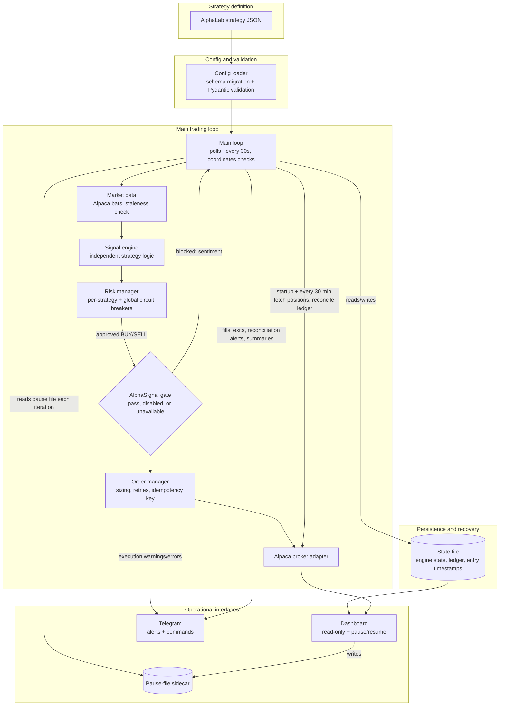
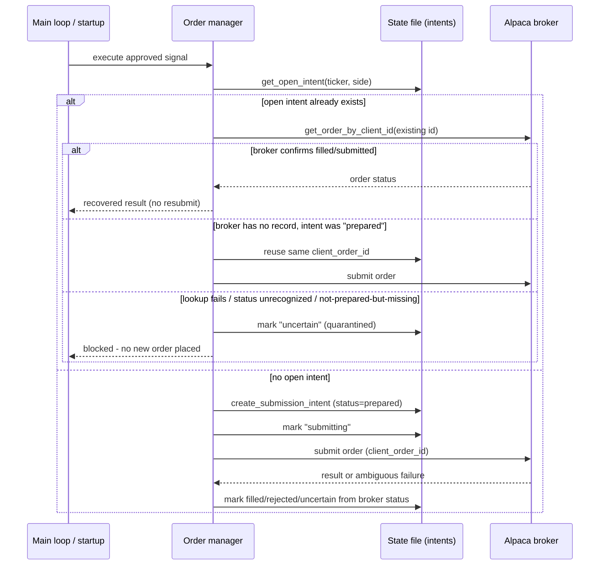

# AlphaLive

An execution and risk engine that consumes strategy exports from [AlphaLab](https://github.com/bernardoguterres/AlphaLab) and can submit orders through Alpaca Markets, built around independently implemented signal logic, layered risk checks, restart-resistant idempotent order submission, persisted strategy state, and broker-position reconciliation.

AlphaLab builds and backtests a strategy and exports a JSON config. AlphaLive loads it, independently regenerates signals from live market data, and runs them through a risk-gate stack before submitting an approved order to Alpaca under a durably-persisted `client_order_id`. That ID is created before the broker call and reused across same-process retries, timeouts, and process restarts, so a crash mid-placement reconciles against what Alpaca actually did instead of risking a duplicate order. Strategy state - open positions, engine internals, entry timestamps, submission intents - is persisted as signal checks and state-changing events complete, and is restored/reconciled against the broker's actual positions on every restart.

---

## Status and Validation Boundary

This is a working prototype with an extensive automated test suite, not a system that has traded real money or run unattended for an extended period.

**What has been exercised:**
- Config loading and schema validation against real AlphaLab strategy JSON exports, including via `run.py --validate-only`.
- Signal generation logic, independently unit-tested and cross-checked against AlphaLab on historical fixtures (see [AlphaLab Compatibility](#alphalab-compatibility-and-measured-parity)).
- Risk management, state persistence, reconciliation, and same-process idempotent retry logic, all covered by unit and integration tests that mock the broker and Telegram.
- The AlphaSignal sentiment gate, tested against a running AlphaSignal instance over real HTTP calls: fail-open behaviour was confirmed for timeout and no-data responses, while blocking was confirmed for explicit threshold-breaching sentiment.

**What has not been exercised:**
- Real Alpaca paper-account runtime: authentication, live order submission, fills, and broker-side reconciliation, end-to-end against a funded account.
- Long-duration unattended runtime - the mechanisms below are implemented and unit-tested, not observed running continuously across days or weeks.
- Any Railway deployment. `railway.toml` and the Dockerfiles describe an intended shape; no Railway environment has been stood up.
- Real-money trading of any kind. Never performed.

Treat everything below as "implemented and tested in isolation," not "proven in production."

---

## Engineering Highlights

- **Independent signal re-implementation.** AlphaLive does not import AlphaLab's strategy code - it re-implements each strategy's logic from scratch against the same JSON schema, so a cross-repo parity test can catch drift instead of trusting one implementation by construction.
- **Layered risk gating.** Every signal passes an ordered sequence of checks - kill switches, trade-frequency/API-budget limits, degraded-mode detection, daily-loss/consecutive-loss breakers, position caps, cooldowns - before an order is considered.
- **Durable submission intents, not just in-process retries.** Each BUY/SELL decision creates a persisted intent with a UUID-derived `client_order_id` *before* any broker call, reused across retries, timeouts, and process restarts until it reaches a terminal status; a 409 or a restart-time lookup is recovered via `get_order_by_client_id()` rather than assumed. See [restart reconciliation](#durable-submission-intents-and-restart-reconciliation) for the full state machine and its remaining network/broker boundary.
- **Persisted, reconciled state.** Signal-engine internals, open positions, entry timestamps, and submission intents are persisted after completed signal checks and relevant position-state updates, restored at boot, then reconciled against Alpaca's actual positions - the broker's ledger wins.
- **Drift detection, not silent trust.** If live broker positions and the internal ledger disagree mid-session (presence or quantity), trading halts rather than continuing on stale assumptions.
- **Configuration-dependent durability.** State persistence only survives a restart if `STATE_FILE` points at a durable path - the default is now an OS-appropriate persistent directory rather than `/tmp` (below).

---

## System Architecture



AlphaLive is a continuously running process: the main loop polls roughly every 30 seconds during market hours, and strategy signal checks and exit checks use their own separate timing guards described below. This describes process structure, not validated 24/7 availability - see [Status and Validation Boundary](#status-and-validation-boundary). Railway is one possible place to run this process; it is not part of the architecture itself, and the diagram deliberately omits it.

---

## Execution Lifecycle and Reliability

On each loop iteration (~30s during market hours), AlphaLive checks whether the market is open, checks the dashboard's pause file, and runs whichever strategy checks are due. Both `1Day` and `1Week` evaluate after ~09:35 ET, gated by a per-ticker "checked today" flag; `1Week` additionally requires that this is the first such check for the current ISO calendar week (a persisted per-ticker week key, so a same-week restart doesn't re-evaluate), and only ever runs when `broker.is_market_open()` says the market is actually open that day - so a Monday holiday naturally defers to the next open session without any separate holiday calendar. `1Hour` checks hourly and `15Min` every 15 minutes via bar-boundary guards. Exit checks (stop loss, take profit, trailing stop) run separately every 5 minutes. The main loop never exits on an unhandled error - a catch-all sleeps 60 seconds and continues.

**Risk checks run in a fixed order:** kill switch (`TRADING_PAUSED` / Telegram `/pause`), trade-frequency limit, API budget, degraded-mode status, daily loss limit, consecutive-loss breaker, position caps, cooldown. SELLs skip the position-cap/cooldown checks but still respect the rest, size only from the currently held broker quantity, and are blocked with no open position - AlphaLive never opens a short.

**The AlphaSignal sentiment gate is optional, fails open by default, and applies to both directions:** a BUY can be blocked by sufficiently negative sentiment, a SELL by sufficiently positive sentiment (same threshold, opposite sign). Timeout, no data, a malformed/self-contradictory response, full degradation, and partial degradation with no usable reliable evidence all bypass it with a distinct, logged reason rather than a silent default. A structurally valid partial degradation (AlphaSignal's `degraded`/`degradation_reason`/`reliable_chunk_count` contract reporting at least one reliable chunk and a non-null score) is instead evaluated through the same threshold policy as undegraded sentiment, tagged distinctly so it's never mistaken for a clean approval. It gates strategy-generated BUY/SELL signals only - stop-loss, take-profit, and trailing-stop exits use a separate path, and neither a bypass nor a degraded evaluation here ever touches position limits, drawdown controls, kill switches, or broker reconciliation, which are independent gates evaluated elsewhere.

**Position reconciliation** compares live Alpaca positions against the persisted ledger, not order history: once at startup (adopting/removing drift with a Telegram notice, not a halt) and again every 30 minutes (where disagreement halts trading).

**Corporate action detection** skips a check and alerts via Telegram on a >20% overnight move, rather than trading a split-distorted bar.

---

## Durable Submission Intents and Restart Reconciliation

Every BUY/SELL decision creates a **submission intent** - `{intent_id, client_order_id, ticker, side, qty, status}` - written to the state file atomically *before* any broker call (`BotState.create_submission_intent`). The `client_order_id` is derived from a fresh UUID, not from ticker/side/timestamp, so two genuinely distinct decisions never collide and one decision keeps the same ID across every retry, timeout, and process restart until it reaches a terminal status.

States: `prepared → submitting → submitted/partially_filled/filled | rejected | cancelled | expired`, with a separate `uncertain` quarantine state and a `reconciled` terminal state once quarantine is resolved.



**On boot**, `_reconcile_open_submission_intents()` walks every non-terminal intent left by a crash and reconciles it against the broker *before* the main loop starts, rather than waiting for the next signal on that ticker - an intent that resolves to `uncertain` alerts via Telegram and keeps blocking new orders for that (ticker, side) until it resolves.

**What this closes:** a crash between intent creation and broker submission, or between broker acceptance and local recording, reuses the same `client_order_id` on the next attempt instead of generating a new one - Alpaca's own idempotency on that field (`get_order_by_client_id`) then determines the real outcome instead of the process guessing.

**What this does not claim:** this is not mathematically exactly-once. If the broker lookup itself is unavailable or returns an unrecognized status, the intent is quarantined (`uncertain`) rather than resubmitted or declared failed - that is a genuine, irreducible network/broker boundary (Alpaca's `get_order_by_client_id` can itself be unreachable), not a guarantee. Quarantine requires the next successful reconciliation (automatic, on the next signal check or restart) or deliberate operator action to clear. See `tests/test_order_intent_lifecycle.py` for the covered crash/restart/ambiguity scenarios.

---

## AlphaLab Compatibility and Measured Parity

AlphaLab and AlphaLive each independently implement every strategy's signal logic - a deliberate choice, since importing AlphaLab's code would make a parity test meaningless.

Two distinct, non-comparable sources of parity evidence exist here; they should not be combined into one headline figure:

| Evidence | What it is | Result |
|---|---|---|
| [`tests/test_signal_parity.py`](tests/test_signal_parity.py) | Reproducible standalone diagnostic on the AAPL 2022-2023 500-bar fixture; writes dated local reports to the gitignored `tests/reports/` directory and is not run in CI (not pytest-collected) | `ma_crossover` 496/500, `rsi_mean_reversion` 457/500, `vwap_reversion` 498/500, `momentum_breakout`/`bollinger_breakout` 500/500; `overall_pass: false` |
| [`tests/test_multi_ticker_parity.py`](tests/test_multi_ticker_parity.py) | Pytest-collected, CI-enforced (`assert result["mismatches"] == 0`), all 7 strategies on real SPY/MSFT data, 500 bars each | 100% except one narrowly scoped, `strict=True` `xfail` |

The `xfail` is `rsi_mean_reversion` on MSFT: 2 of 500 bars mismatch, root-caused to AlphaLab's and AlphaLive's ATR calculations disagreeing slightly, occasionally shifting an ATR-based stop-loss exit by a bar (bars 44, 54). `strict=True` means the test fails outright if that gap moves for an unverified reason.

The standalone diagnostic's fixtures (`tests/fixtures/expected_signals_*.csv`) are all generated by `tests/fixtures/generate_expected_signals.py` running AlphaLive's *own* engine to produce the "expected" signals - self-generated regression data, never sourced from AlphaLab, so they can only ever detect drift against a previously-captured run of this same codebase, not AlphaLab/AlphaLive discrepancy. The `rsi_mean_reversion` fixture's 43 mismatches specifically reflect it having gone stale relative to a later, independently-motivated change to AlphaLive's own RSI implementation (the switch to canonical Wilder RSI) - not a live AlphaLab discrepancy, and not meaningful parity evidence one way or the other. The `ma_crossover` (4 bars) and `vwap_reversion` (2 bars) standalone mismatches are unresolved and not root-caused here. None of the standalone diagnostic's fixtures should be read as independent AlphaLab ground truth; only `tests/test_multi_ticker_parity.py`'s SPY/MSFT fixtures are sourced that way (see its docstring for which strategies' fixtures come directly from AlphaLab versus which are historical AlphaLive-output snapshots guarding against regression only).

This is not a claim of broad or exact cross-repository parity, and no single aggregate percentage is published across strategies or across the two evidence sources above - they measure different things against different baselines and are not comparable.

---

## Dashboard and Operational Interfaces

A separate FastAPI dashboard process reads the bot's state file and Alpaca account directly. It is **read-only with respect to trading** - it cannot place or cancel orders. Its two operational controls:

- **Pause / resume**, via a dedicated pause-file sidecar next to the main state file, read fresh every loop iteration (~30s), independent of Telegram `/pause` and `TRADING_PAUSED`.
- **A Railway redeploy endpoint**, calling Railway's GraphQL API if the three required env vars are set. Exists in code; not exercised against a real Railway deployment.

It pushes account, position, order, and risk data over a WebSocket every 5 seconds, and only reflects reality when it shares the bot's `STATE_FILE` path.

Telegram, where configured, supports `/status`, `/pause`, `/resume`, `/close_all` (requires `/confirm_close`), `/config [TICKER]`, `/performance [TICKER]`, and `/help`, and sends successful-trade, position-exit, execution-warning, reconciliation and daily-summary notifications. Failures are non-fatal - trading continues. In multi-strategy mode, every command operates across all registered strategies rather than defaulting to the first configured one: `/pause`/`/resume` gate every strategy (routed through a shared risk-control object, persisted so a restart doesn't silently clear an operator halt; `/resume` reports any other active halt - env var, circuit breaker, degraded mode - that keeps trading stopped rather than claiming it resumed); `/status` reports an aggregate plus a per-strategy summary; `/close_all` closes every open position through the strategy that actually owns it and reports which ones failed or remain uncertain rather than declaring blanket success; `/config`/`/performance` return a per-strategy summary unless given an explicit ticker (e.g. `/config AAPL`) for full detail on one. A single-strategy deployment behaves exactly as an untargeted command always did.

---

## Supported Strategies

| Strategy | Timeframe | Entry | Exit |
|---|---|---|---|
| `ma_crossover` | Daily/intraday | Fast SMA crosses above slow SMA | Opposite cross |
| `rsi_mean_reversion` | Daily/intraday | RSI below oversold threshold | RSI returns to 50 |
| `momentum_breakout` | Daily/intraday | N-day high breakout + volume surge | Trailing stop / N-day low breakdown |
| `bollinger_breakout` | Daily/intraday | Close above BB upper band for N bars + volume | Close below BB middle |
| `vwap_reversion` | Daily/intraday | Price deviates from VWAP beyond N standard deviations + RSI | Price returns to VWAP |
| `bollinger_rsi_combo` | Daily/intraday | Price at/below BB lower band AND RSI oversold | Price at/above BB middle OR RSI overbought |
| `trend_adaptive_rsi` | Daily/intraday | RSI below regime-adjusted buy threshold | RSI above regime-adjusted sell threshold |
| `greenblatt_weekly` | 1Week | Weekly RSI oversold OR 10w/50w golden cross | 20% trailing stop from peak (always active); RSI/SMA exits optional, off by default. Minimum hold: 52 weeks |

Walk-forward backtests in AlphaLab showed the seven daily/intraday strategies underperforming buy-and-hold SPY historically; `greenblatt_weekly` is the current area of active development. This is backtest evidence from AlphaLab, not a claim about AlphaLive's live performance, which is unmeasured. `vwap_reversion` is implemented and parity-tested but not currently exported from AlphaLab as a deployable config.

---

## Quick Start

**Prerequisites:** Python 3.11+, an Alpaca paper trading account (free), optionally a Telegram bot.

```bash
git clone https://github.com/bernardoguterres/AlphaLive.git
cd AlphaLive
pip install -r requirements.txt
cp .env.example .env   # add ALPACA_API_KEY / ALPACA_SECRET_KEY
```

Validate the config and broker connection without placing any orders:

```bash
python run.py --validate-only
```

Run in dry-run mode (signals are logged, nothing is submitted to Alpaca):

```bash
python run.py --dry-run --config configs/example_strategy.json
```

Run against a paper account (default; `ALPACA_PAPER=true`):

```bash
python run.py --config configs/example_strategy.json
```

Test signal logic against historical replay data (still authenticates to Alpaca at startup, so paper credentials are required even for replay):

```bash
python run.py --config configs/your_strategy.json --replay-mode \
  --replay-start 2015-01-01 --replay-end 2019-12-31 --dry-run
```

---

## Deployment Configuration

AlphaLive can run as a long-lived local process or as a container. A `Dockerfile` (bot) and `Dockerfile.dashboard` (dashboard, optional/separate) exist, plus a `railway.toml` declaring Railway's healthcheck path and restart policy. **These describe an intended shape; no actual Railway deployment has been exercised.** Treat Railway configuration as available, not proven.

**Durable state requires explicit configuration.** `BotState` defaults `STATE_FILE` to `/tmp/alphalive_state.json`, which does not survive a container restart or redeploy. Restart-safe recovery needs `STATE_FILE` on a persistent path (a mounted volume, `PERSISTENT_STORAGE=true`); otherwise every restart starts empty and reconciliation falls back to trusting Alpaca as ground truth. Trailing-stop strategies refuse to start unless `PERSISTENT_STORAGE=true` is set.

Key environment variables:

| Variable | Required | Notes |
|---|---|---|
| `ALPACA_API_KEY`, `ALPACA_SECRET_KEY` | Yes | Alpaca credentials |
| `STRATEGY_CONFIG` / `STRATEGY_CONFIG_DIR` | Yes (one of) | Single strategy or multi-strategy directory |
| `ALPACA_PAPER` | No, default `true` | Set `false` only for live trading |
| `STATE_FILE` | No, default `/tmp/...` | Must be a durable path for restart safety |
| `PERSISTENT_STORAGE` | No, default `false` | Required if using trailing stops |
| `DRY_RUN` | No, default `false` | Logs signals, places no orders |
| `TRADING_PAUSED` | No, default `false` | Env-level kill switch |
| `TELEGRAM_BOT_TOKEN`, `TELEGRAM_CHAT_ID` | No | Enables notifications and commands |
| `ALPHASIGNAL_URL`, `ALPHASIGNAL_ENABLED` | No | Optional sentiment gate |

Multi-strategy mode (`STRATEGY_CONFIG_DIR`) enforces one strategy per ticker at startup - Alpaca holds a single merged position per symbol, so two strategies on the same ticker can't be attributed, and this is rejected before the loop starts.

---

## Verification

```bash
pytest tests/ -v --cov=alphalive             # 780 tests collected, one intentional xfail
pytest tests/test_multi_ticker_parity.py     # CI-enforced signal parity check
python tests/test_signal_parity.py           # standalone parity report script, not run in CI
python run.py --validate-only                # config + broker connectivity check
```

The one `xfail` is the `rsi_mean_reversion`/MSFT ATR residual from [AlphaLab Compatibility](#alphalab-compatibility-and-measured-parity), `strict=True` so the gap can't drift silently. In the pytest suite, external integrations are mocked, so its tests require no API keys or external network access. `python run.py --validate-only` is different: it requires valid Alpaca paper credentials and network access because it checks broker connectivity and market data. CI runs on every push/PR to `main` with dummy credentials.

---

## Known Limitations

- **No exercised Alpaca paper-account runtime** - authentication, order placement, fills, reconciliation against a real account.
- **No exercised Railway deployment** - the configuration exists; no service has actually been stood up.
- **No long-duration unattended runtime** - reliability mechanisms are unit/integration-tested, not observed over days or weeks live.
- **Submission intents close the restart-duplicate-order window as far as Alpaca's API permits, not exactly-once.** A broker lookup that's itself unavailable, or returns an unrecognized status, quarantines the intent (`uncertain`) rather than guessing success or failure - see [Durable Submission Intents](#durable-submission-intents-and-restart-reconciliation). This replaces the previous timestamp-based, non-persisted idempotency key.
- **`STATE_FILE` now defaults to an OS-appropriate persistent path** (e.g. `~/Library/Application Support/AlphaLive/` on macOS, XDG data dir on Linux) instead of `/tmp`, and a hosted (Railway-detected) deploy with an ephemeral `STATE_FILE` and no `PERSISTENT_STORAGE` logs a loud startup warning. This does not by itself make Railway persistent - a Volume still has to be mounted and `STATE_FILE`/`PERSISTENT_STORAGE` set explicitly.
- **`1Week` strategies evaluate once per ISO calendar week** on the first session that week the market is actually open (Monday ordinarily; the next open session if Monday is a holiday), gated by a persisted per-ticker week key so a restart never re-evaluates the same week. Holiday/session awareness comes entirely from `broker.is_market_open()` (the existing calendar abstraction - the main loop only reaches the weekly-check code when the market is open that day); AlphaLive introduces no separate calendar service. Weekly resampling excludes the current, still-incomplete week's bar.
- **Parity is not exact or exhaustive.** The CI-enforced `rsi_mean_reversion`/MSFT exception is root-caused to the two ATR implementations (bars 44, 54). The standalone AAPL diagnostic separately shows `ma_crossover` (4/500) and `vwap_reversion` (2/500) mismatches not root-caused here, and an `rsi_mean_reversion` gap traced to a stale, self-referential fixture (see [parity evidence](#alphalab-compatibility-and-measured-parity)) - none of these are claims of exact or exhaustive parity.
- **The dashboard cannot place orders** and is only as current as the shared state file and Alpaca account it reads.
- **Telegram commands operate across every registered strategy** (`/pause`/`/resume` via a shared `GlobalRiskManager`, persisted so a restart doesn't silently clear an operator-issued halt; `/status`/`/close_all` aggregate; `/config`/`/performance` accept an optional ticker). `TRADING_PAUSED` and the dashboard's pause file remain independent, global, and unaffected by `/resume`.
- **AlphaSignal partial degradation** (`status="degraded"`, `degradation_reason="partial_extraction_failure"`, at least one reliable chunk, a non-null score) is evaluated through the same threshold policy as undegraded sentiment, tagged distinctly so it's never reported as a clean approval. A partial response with no usable reliable evidence (zero reliable chunks, or a null score) fails open, same as full degradation.
- **A single in-process lock serializes BotState mutations** across the main loop and the Telegram listener's background thread - it does not extend across processes; the dashboard (a separate process) still only interacts through the state file itself, unaffected by this lock.
- **`configs/production/` is a historical directory name**, not a claim of production readiness - none of its configs have passed walk-forward validation.
- **PDT rule is not tracked** - AlphaLive doesn't count day trades; sub-$25k live accounts must monitor Alpaca's own counter.
- **No real-money trading has ever been performed.**

---

## License

All rights reserved. This is proprietary, original work - no license is granted for use, copying, or redistribution.

---

## Disclaimer

**Trading involves substantial risk of loss. Past performance does not guarantee future results.**

AlphaLive is provided "as is," without warranty of any kind. You are responsible for your own trading decisions. No real-money trading has ever been performed with this system, and nothing in this document should be read as a claim of production readiness, validated live trading, or continuous uptime. Test on paper before considering real funds, and monitor any deployment regularly.

**Use at your own risk.**
